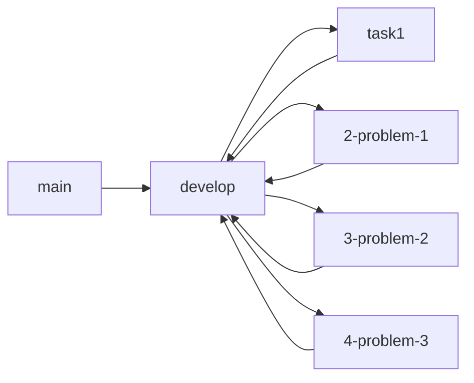

# Course GitHub Test

[](https://opensource.org/licenses/MIT)
[](https://www.python.org/downloads/)

Этот репозиторий представляет собой комплексный тестовый проект, разработанный для изучения и практики рабочих процессов Git и GitHub. Он демонстрирует лучшие практики в контроле версий, стратегиях ветвления, сотрудничестве и управлении проектами с использованием GitHub.

## 📋 Содержание

- [Описание](#описание)
- [Возможности](#возможности)
- [Обзор веток](#обзор-веток)
- [Предварительные требования](#предварительные-требования)
- [Установка](#установка)
- [Использование](#использование)
- [Структура проекта](#структура-проекта)
- [Вклад в проект](#вклад-в-проект)
- [Кодекс поведения](#кодекс-поведения)
- [Лицензия](#лицензия)
- [Поддержка](#поддержка)

## 📖 Описание

Проект `course_github_test` служит образовательным ресурсом для разработчиков, изучающих Git и GitHub. Он содержит практические примеры и решения распространенных проблем, с которыми сталкиваются при работе с системами контроля версий и платформами совместной разработки.

Проект структурирован вокруг решения трех основных проблем, каждая из которых демонстрирует различные аспекты рабочего процесса Git:

- **Проблема 1**: Введение в базовые операции Git (commit, push, pull)
- **Проблема 2**: Продвинутые стратегии ветвления и workflows слияния
- **Проблема 3**: Обработка конфликтов слияния и совместная разработка

## ✨ Возможности

- Полная демонстрация рабочего процесса Git
- Примеры стратегий ветвления
- Примеры разрешения конфликтов слияния
- Шаблоны интеграции с GitHub
- Настройка автоматизированного тестирования
- Конфигурация инструментов качества кода
- Комплексная документация

## 🌿 Обзор веток

Этот репозиторий использует структурированную модель ветвления:

### Основные ветки
- **`main`**: Продукционный код, стабильные релизы
- **`develop`**: Интеграционная ветка для функций, последнее состояние разработки

### Ветки функций
- **`task1`**: Начальная реализация задачи и настройка
- **`2-problem-1`**: Решение, демонстрирующее базовые операции Git
- **`3-problem-2`**: Продвинутые стратегии ветвления и слияния
- **`4-problem-3`**: Сложное разрешение конфликтов слияния и сотрудничество

### Рабочий процесс


## 📋 Предварительные требования

Перед запуском этого проекта убедитесь, что у вас установлены:

- **Python 3.6 или выше**
- **Git** (версия 2.0 или выше)
- **pip** (установщик пакетов Python)

Вы можете проверить версии:
```bash
python --version
git --version
pip --version
```

## 🚀 Установка

Следуйте этим шагам для локальной настройки проекта:

### 1. Клонируйте репозиторий
```bash
git clone https://github.com/todmiv/course_github_test.git
cd course_github_test
```

### 2. Настройте виртуальное окружение Python (рекомендуется)
```bash
# Создайте виртуальное окружение
python -m venv venv

# Активируйте виртуальное окружение
# В Windows:
venv\Scripts\activate
# В macOS/Linux:
# source venv/bin/activate
```

### 3. Установите зависимости
```bash
pip install -r requirements.txt
```

### 4. Проверьте установку
```bash
python main.py
```

Вы должны увидеть вывод, подтверждающий корректную работу проекта.

## 💻 Использование

### Запуск основного скрипта
```bash
python main.py
```

Это отобразит:
- Приветственное сообщение
- Проверку версии Python
- Информацию о текущей директории
- Список файлов в проекте

### Исследование веток
Для изучения различных решений:
```bash
# Переключитесь на конкретную ветку
git checkout 2-problem-1

# Просмотрите историю ветки
git log --oneline

# Вернитесь к develop
git checkout develop
```

### Тестирование
Запустите тесты с помощью pytest:
```bash
pytest
```

### Качество кода
Проверьте качество кода:
```bash
# Линтинг
flake8 .

# Форматирование кода
black .
```

## 📁 Структура проекта

```
course_github_test/
│
├── .github/
│   ├── ISSUE_TEMPLATE/
│   │   ├── bug_report.md
│   │   └── feature_request.md
│   └── PULL_REQUEST_TEMPLATE.md
│
├── main.py                 # Основной скрипт приложения
├── requirements.txt        # Зависимости Python
├── .gitignore             # Правила игнорирования Git
├── LICENSE                # Лицензия MIT
├── README.md              # Документация проекта
├── CONTRIBUTING.md        # Руководство по вкладу
└── CODE_OF_CONDUCT.md     # Кодекс поведения
```

## 🤝 Вклад в проект

Мы приветствуем вклад! Пожалуйста, ознакомьтесь с нашим [Руководством по вкладу](CONTRIBUTING.md) для подробной информации о:

- Как внести код
- Сообщении об ошибках
- Предложении функций
- Стиле кода
- Требованиях к тестированию

### Быстрый старт для участников
1. Форкните репозиторий
2. Создайте ветку функции: `git checkout -b feature/amazing-feature`
3. Внесите изменения и закоммитьте: `git commit -m 'Add amazing feature'`
4. Отправьте в ветку: `git push origin feature/amazing-feature`
5. Откройте Pull Request

## 📜 Кодекс поведения

Этот проект придерживается кодекса поведения для обеспечения приветливой среды для всех участников. Пожалуйста, прочитайте наш [Кодекс поведения](CODE_OF_CONDUCT.md) перед участием.

## 📄 Лицензия

Этот проект лицензирован под MIT License - подробности см. в файле [LICENSE](LICENSE).

```
Лицензия MIT

Copyright (c) 2025 todmiv

Настоящим предоставляется бесплатное разрешение любому лицу, получившему копию
этого программного обеспечения и связанных файлов документации ("Программное обеспечение"), 
распоряжаться Программным обеспечением без ограничений, включая без ограничения права
использовать, копировать, изменять, сливать, публиковать, распространять, сублицензировать и/или продавать
копии Программного обеспечения, а также разрешать лицам, которым предоставляется Программное обеспечение,
делать это при соблюдении следующих условий:

Указанное выше уведомление об авторских правах и это уведомление о разрешении должны быть включены во все
копии или существенные части Программного обеспечения.

ПРОГРАММНОЕ ОБЕСПЕЧЕНИЕ ПРЕДОСТАВЛЯЕТСЯ "КАК ЕСТЬ", БЕЗ ГАРАНТИЙ ЛЮБОГО ВИДА, ЯВНЫХ ИЛИ
ПОДРАЗУМЕВАЕМЫХ, ВКЛЮЧАЯ, НО НЕ ЛИМИТИРУЯСЬ ГАРАНТИЯМИ КОММЕРЧЕСКОЙ ЦЕННОСТИ,
ПРИГОДНОСТИ ДЛЯ КОНКРЕТНОЙ ЦЕЛИ И НЕНАРУШЕНИЯ ПРАВ. НИ ПРИ КАКИХ ОБСТОЯТЕЛЬСТВАХ АВТОРЫ ИЛИ
ПРАВООБЛАДАТЕЛИ НЕ НЕСУТ ОТВЕТСТВЕННОСТИ ЗА ЛЮБЫЕ ПРЕТЕНЗИИ, УБЫТКИ ИЛИ ИНУЮ ОТВЕТСТВЕННОСТЬ,
БУДЬ ТО В ДОГОВОРНОМ ИСКАНИИ, НЕБРЕЖНОСТИ ИЛИ ИНОМ ГРАЖДАНСКОМ ПРАВОНАРУШЕНИИ,
ВОЗНИКАЮЩЕМ ИЗ ИЛИ В СВЯЗИ С ПРОГРАММНЫМ ОБЕСПЕЧЕНИЕМ ИЛИ ИСПОЛЬЗОВАНИЕМ ИЛИ ДРУГИМИ ДЕЙСТВИЯМИ С ПРОГРАММНЫМ ОБЕСПЕЧЕНИЕМ.
```
---

**Приятного кодинга! 🚀**

